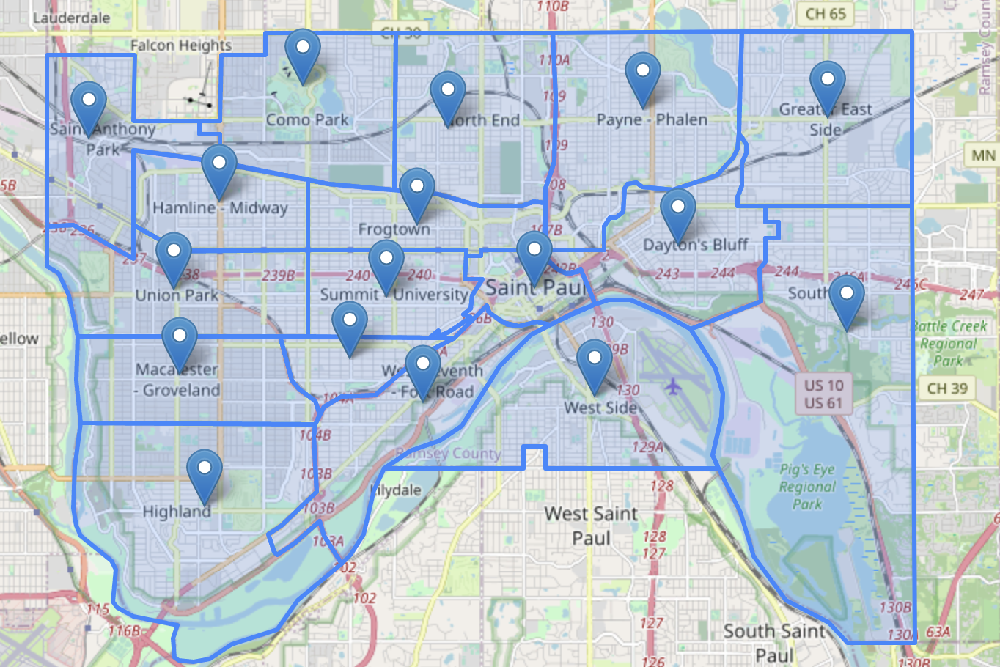
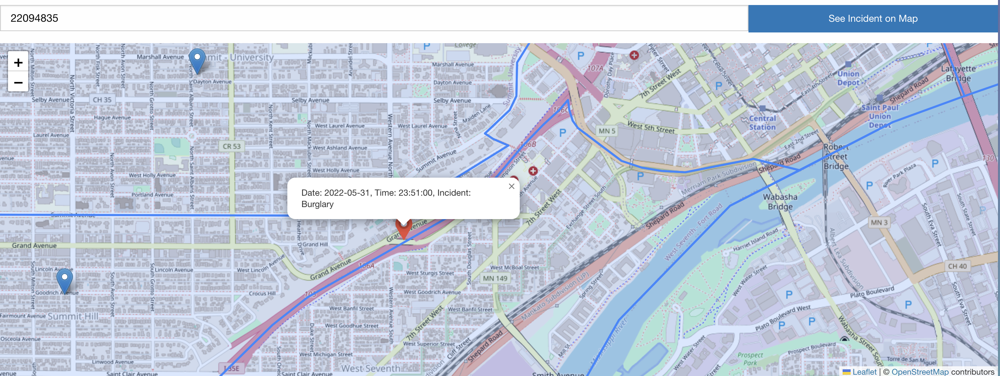

<a name="readme-top"></a>

[![Contributors][contributors-shield]][contributors-url]
[![Forks][forks-shield]][forks-url]
[![Stargazers][stars-shield]][stars-url]
[![Issues][issues-shield]][issues-url]
[![MIT License][license-shield]][license-url]


<h3 align="center">CrimeWebApp</h3>

  <p align="center">
    A simpe Vue-based single page application (SPA) to display crime statistics from a database. Integrates multiple APIs to make this work. 
    <br />
    <a href="https://github.com/hisk2323/CrimeWebApp"><strong>Explore the docs »</strong></a>
    <br />
    <br />
    ·
    <a href="https://github.com/hisk2323/CrimeWebApp/issues">Report Bug</a>
    ·
    <a href="https://github.com/hisk2323/CrimeWebApp/issues">Request Feature</a>
  </p>
</div>


<!-- TABLE OF CONTENTS -->
<details>
  <summary>Table of Contents</summary>
  <ol>
    <li>
      <a href="#about-the-project">About The Project</a>
      <ul>
        <li><a href="#built-with">Built With</a></li>
      </ul>
    </li>
    <li>
      <a href="#getting-started">Getting Started</a>
      <ul>
        <li><a href="#prerequisites">Prerequisites</a></li>
        <li><a href="#installation">Installation</a></li>
      </ul>
    </li>
    <li><a href="#usage">Usage</a></li>
    <li><a href="#roadmap">Roadmap</a></li>
    <li><a href="#contributing">Contributing</a></li>
    <li><a href="#license">License</a></li>
    <li><a href="#contact">Contact</a></li>
    <li><a href="#acknowledgments">Acknowledgments</a></li>
  </ol>
</details>


<!-- ABOUT THE PROJECT -->
## About The Project
A simple Vue-based single page application for the purpose of displaying crime statistics from a database on a map. Integrates multiple APIs and services,
such as Nominatim and Leaflet.

<p align="right">(<a href="#readme-top">back to top</a>)</p>


### Built With

* [![Vue][Vue.js]][Vue-url]
* [![Bootstrap][Bootstrap.com]][Bootstrap-url]
* [![JQuery][JQuery.com]][JQuery-url]
* [![Leaflet][Leafletjs.com]](https://leafletjs.com/)
* [![Nominatim][Nominatim.com]](https://nominatin.org/)

<p align="right">(<a href="#readme-top">back to top</a>)</p>


<!-- GETTING STARTED -->
## Getting Started

This project is quite simple to get running locally. Short of installing a few NPM packages, this repository contains
everything you need to get started. 

### Prerequisites

You will need [NPM](https://www.npmjs.com/) installed before you can get a local copy of this project up and running.

### Installation


1. Clone the repo
   ```sh
   git clone https://github.com/hisk2323/CrimeWebApp.git
   ```
2. Install NPM packages
   ```sh
   npm install
   ```

<p align="right">(<a href="#readme-top">back to top</a>)</p>


<!-- USAGE EXAMPLES -->
## Screenshots





<p align="right">(<a href="#readme-top">back to top</a>)</p>


<!-- ROADMAP -->
## Coming Features

- [ ] Fix Leaflet bug with location markers not rendering properly 
- [ ] Improved styling

See the [open issues](https://github.com/hisk2323/CrimeWebApp/issues) for a current list of known issues or other planned features!

<p align="right">(<a href="#readme-top">back to top</a>)</p>


<!-- CONTRIBUTING -->
## Contributing

Contributions are what make the open source community such an amazing place to learn, inspire, and create. Any contributions you make are **greatly appreciated**.

If you have a suggestion that would make this better, please fork the repo and create a pull request. You can also simply open an issue with the tag "enhancement".
Don't forget to give the project a star! Thanks again!

1. Fork the Project
2. Create your Feature Branch (`git checkout -b feature/AmazingFeature`)
3. Commit your Changes (`git commit -m 'Add some AmazingFeature'`)
4. Push to the Branch (`git push origin feature/AmazingFeature`)
5. Open a Pull Request

<p align="right">(<a href="#readme-top">back to top</a>)</p>


<!-- LICENSE -->
## License

Distributed under the MIT License. See `LICENSE.txt` for more information.

<p align="right">(<a href="#readme-top">back to top</a>)</p>


<!-- CONTACT -->
## Contact

Project Link: [https://github.com/hisk2323/CrimeWebApp](https://github.com/hisk2323/CrimeWebApp)

<p align="right">(<a href="#readme-top">back to top</a>)</p>


<!-- ACKNOWLEDGMENTS -->
## Acknowledgments

* Big thanks to [Neshua](https://github.com/neshua) - we worked together on this project

<p align="right">(<a href="#readme-top">back to top</a>)</p>


<!-- MARKDOWN LINKS & IMAGES -->
<!-- https://www.markdownguide.org/basic-syntax/#reference-style-links -->
[contributors-shield]: https://img.shields.io/github/contributors/hisk2323/CrimeWebApp.svg?style=for-the-badge
[contributors-url]: https://github.com/hisk2323/CrimeWebApp/graphs/contributors
[forks-shield]: https://img.shields.io/github/forks/hisk2323/CrimeWebApp.svg?style=for-the-badge
[forks-url]: https://github.com/hisk2323/CrimeWebApp/network/members
[stars-shield]: https://img.shields.io/github/stars/hisk2323/CrimeWebApp.svg?style=for-the-badge
[stars-url]: https://github.com/hisk2323/CrimeWebApp/stargazers
[issues-shield]: https://img.shields.io/github/issues/hisk2323/CrimeWebApp.svg?style=for-the-badge
[issues-url]: https://github.com/hisk2323/CrimeWebApp/issues
[license-shield]: https://img.shields.io/github/license/hisk2323/CrimeWebApp.svg?style=for-the-badge
[license-url]: https://github.com/hisk2323/CrimeWebApp/blob/master/LICENSE.txt
[product-screenshot]: Screenshots/screenshot1.png
[Vue.js]: https://img.shields.io/badge/Vue.js-35495E?style=for-the-badge&logo=vuedotjs&logoColor=4FC08D
[Vue-url]: https://vuejs.org/
[Angular.io]: https://img.shields.io/badge/Angular-DD0031?style=for-the-badge&logo=angular&logoColor=white
[Angular-url]: https://angular.io/
[Bootstrap.com]: https://img.shields.io/badge/Bootstrap-563D7C?style=for-the-badge&logo=bootstrap&logoColor=white
[Bootstrap-url]: https://getbootstrap.com
[JQuery.com]: https://img.shields.io/badge/jQuery-0769AD?style=for-the-badge&logo=jquery&logoColor=white
[JQuery-url]: https://jquery.com 
[Leafletjs.com]: https://img.shields.io/badge/Leaflet-199900?style=for-the-badge&logo=Leaflet&logoColor=white
[Nominatim.com]: https://img.shields.io/badge/-nominatim-blue?style=for-the-badge&logo=Nominatim&logoColor=white